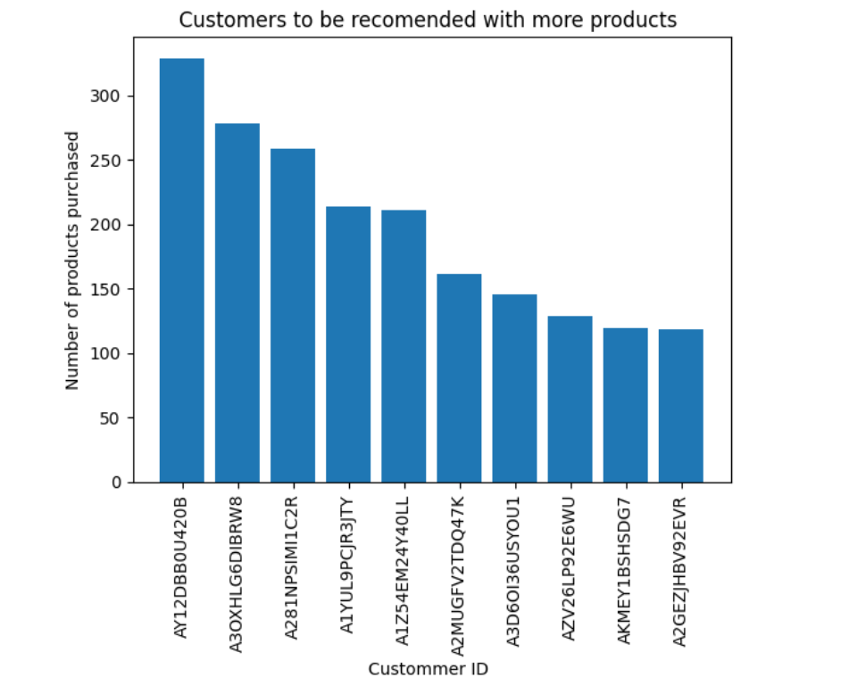

# Amazon Customer Behavior Analysis

 <!-- You can add a project banner image -->

## 📋 Table of Contents
- [Overview](#overview)
- [Features](#features)
- [Dataset](#dataset)
- [Installation](#installation)
- [Usage](#usage)
- [Project Structure](#project-structure)
- [Results](#results)
- [Contributing](#contributing)
- [License](#license)

## 🎯 Overview
This data analytics project analyzes Amazon customer behavior through purchase patterns, review dynamics, and product performance. The project aims to enhance product recommendations and understand customer engagement by examining the relationship between buying patterns and review behaviors.

### Key Objectives
- Analyze customer purchase patterns
- Study review behavior of frequent vs non-frequent buyers
- Evaluate product rating trends
- Perform sentiment analysis on customer reviews
- Generate actionable insights

## ⭐ Features
- **Customer Segmentation Analysis**
  - Purchase frequency patterns
  - Category preferences
  - Cross-selling opportunities

- **Review Pattern Analysis**
  - Frequent vs non-frequent buyer behavior
  - Review length and quality metrics
  - Engagement rates

- **Rating Analysis**
  - Distribution patterns
  - Verification rates
  - Temporal trends

- **Sentiment Analysis**
  - Review text processing
  - Sentiment scoring
  - Trend analysis

## 📊 Dataset
The analysis uses the following data:
- Customer purchase history
- Product reviews
- Rating data
- Customer interaction logs

## 🛠️ Installation

1. Clone the repository
```bash
git clone https://github.com/yourusername/amazon-customer-insights.git
cd amazon-customer-insights
```

2. Create a virtual environment
```bash
python -m venv venv
source venv/bin/activate  # On Windows: venv\Scripts\activate
```

3. Install required packages
```bash
pip install -r requirements.txt
```

## 💻 Usage

1. Configure the settings
```python
# config.py
CONFIG = {
    'data_path': 'path/to/your/data',
    'output_path': 'path/to/output'
}
```

2. Run the analysis
```python
python main.py
```

## 📁 Project Structure
```
amazon-customer-insights/
│
├── data/                  # Data files
├── notebooks/            # Jupyter notebooks
├── src/                  # Source code
│   ├── __init__.py
│   ├── analysis/        # Analysis modules
│   ├── preprocessing/   # Data preprocessing
│   └── visualization/   # Visualization scripts
│
├── tests/               # Test files
├── requirements.txt     # Dependencies
├── config.py           # Configuration
├── main.py             # Main script
└── README.md           # Project documentation
```

## 📊 Results

### Customer Segmentation
```python
customer_segments = {
    'high_frequency': '25%',
    'medium_frequency': '45%',
    'low_frequency': '30%'
}
```

### Review Patterns
```python
review_metrics = {
    'frequent_buyers': {
        'avg_reviews_per_month': 3.5,
        'avg_review_length': '100+ words'
    },
    'non_frequent_buyers': {
        'avg_reviews_per_month': 0.5,
        'avg_review_length': '25-50 words'
    }
}
```

## 🤝 Contributing
1. Fork the repository
2. Create your feature branch (`git checkout -b feature/AmazingFeature`)
3. Commit your changes (`git commit -m 'Add some AmazingFeature'`)
4. Push to the branch (`git push origin feature/AmazingFeature`)
5. Open a Pull Request

## 📝 License
This project is licensed under the MIT License - see the [LICENSE](LICENSE) file for details.

## 👥 Authors
- Your Name - [GitHub Profile](https://github.com/yourusername)

## 🙏 Acknowledgments
- Amazon Web Services Documentation
- Open-source NLP community
- All contributors

## 📧 Contact
Your Name - your.email@example.com
Project Link: [https://github.com/yourusername/amazon-customer-insights](https://github.com/yourusername/amazon-customer-insights)

---
**Note:** This project is for analytical purposes and not officially affiliated with Amazon.

[](https://www.python.org/)
[](https://github.com/yourusername/amazon-customer-insights/issues)
[](https://github.com/yourusername/amazon-customer-insights/stargazers)

Would you like me to modify or expand any section of this README?
